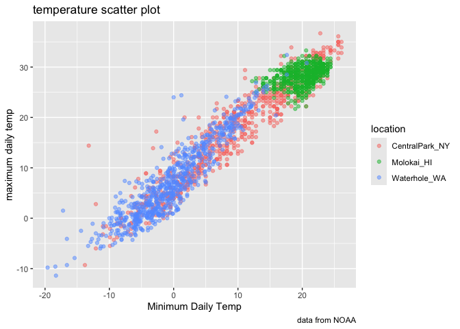

Data Viz
================
2025-09-30

``` r
library(tidyverse)
```

    ## ── Attaching core tidyverse packages ──────────────────────── tidyverse 2.0.0 ──
    ## ✔ dplyr     1.1.4     ✔ readr     2.1.5
    ## ✔ forcats   1.0.0     ✔ stringr   1.5.1
    ## ✔ ggplot2   3.5.2     ✔ tibble    3.3.0
    ## ✔ lubridate 1.9.4     ✔ tidyr     1.3.1
    ## ✔ purrr     1.1.0     
    ## ── Conflicts ────────────────────────────────────────── tidyverse_conflicts() ──
    ## ✖ dplyr::filter() masks stats::filter()
    ## ✖ dplyr::lag()    masks stats::lag()
    ## ℹ Use the conflicted package (<http://conflicted.r-lib.org/>) to force all conflicts to become errors

``` r
library(p8105.datasets)
data("weather_df")
library(patchwork)
```

## Scatterplot

``` r
weather_df %>% 
  ggplot(aes(x = tmin, y = tmax)) +
  geom_point(aes(color = name), alpha = 0.5) +
  labs(
    x = "Minimum Daily Temp",
    y = "maximum daily temp", 
    title = "temperature scatter plot",
    caption = "data from NOAA",
    color = "location"
  )
```

    ## Warning: Removed 17 rows containing missing values or values outside the scale range
    ## (`geom_point()`).

<!-- -->

## Scales

``` r
weather_df %>% 
  ggplot(aes(x = tmin, y = tmax)) +
  geom_point(aes(color = name), alpha = 0.5) +
  labs(
    x = "Minimum Daily Temp",
    y = "maximum daily temp", 
    title = "temperature scatter plot",
    caption = "data from NOAA",
    color = "location"
  ) +
  scale_x_continuous(
    breaks = c(-20, 0, 25), 
    labels = c("-20C", "0", "25"),
  ) +
  scale_y_continuous(
    trans = "sqrt",
    limits = c(10, 30)
  )
```

    ## Warning in transformation$transform(x): NaNs produced

    ## Warning in scale_y_continuous(trans = "sqrt", limits = c(10, 30)): sqrt
    ## transformation introduced infinite values.

    ## Warning: Removed 843 rows containing missing values or values outside the scale range
    ## (`geom_point()`).

<!-- -->

``` r
ggp_temperature =
  weather_df %>% 
  ggplot(aes(x = tmin, y = tmax)) +
  geom_point(aes(color = name), alpha = 0.5) +
  labs(
    x = "Minimum Daily Temp",
    y = "maximum daily temp", 
    title = "temperature scatter plot",
    caption = "data from NOAA",
    color = "location"
  ) +
  scale_x_continuous(
    breaks = c(-20, 0, 25), 
    labels = c("-20C", "0", "25"),
  ) +
  viridis::scale_color_viridis(
    discrete = TRUE
  )
```

## Themes

make my base plot

``` r
ggp_temperature +
  theme_minimal() +
  theme(legend.position = "bottom")
```

    ## Warning: Removed 17 rows containing missing values or values outside the scale range
    ## (`geom_point()`).

<!-- -->

``` r
ggp_temperature +
  theme_bw () +
  theme(legend.position = "bottom")
```

    ## Warning: Removed 17 rows containing missing values or values outside the scale range
    ## (`geom_point()`).

<!-- -->

``` r
ggsave("weather_scatterplot.png", ggp_temperature)
```

    ## Saving 7 x 5 in image

    ## Warning: Removed 17 rows containing missing values or values outside the scale range
    ## (`geom_point()`).

## Adding data to geoms

``` r
central_park_df = 
  weather_df %>% 
  filter(name == "CentralPark_NY")

molokai_df = 
  weather_df %>% 
  filter(name == "Molokai_HI")

ggplot(data = molokai_df, aes(x = date, y = tmax, color = name))+
  geom_point() +
  geom_line(data = central_park_df)
```

    ## Warning: Removed 1 row containing missing values or values outside the scale range
    ## (`geom_point()`).

<!-- -->
